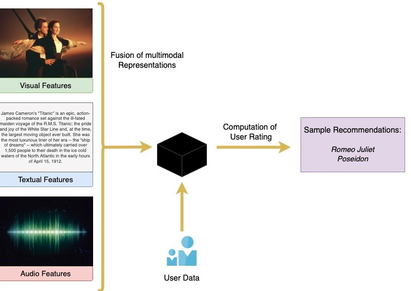
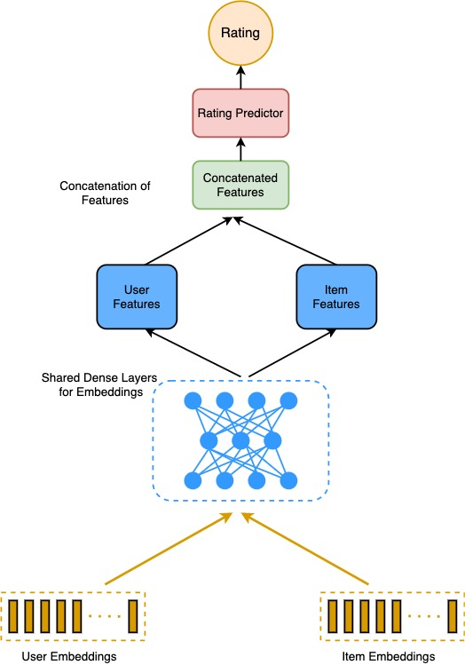

# Multi-Modal-Recommendation-System
This is the official implementation of Multi-Modal Attention based Siamese Network for Unsupervised video rating prediction mentioned in the paper [Towards Developing a Multi-Modal Video Recommendation System](https://ieeexplore.ieee.org/document/9892382).

# Introduction
OTT platforms are on the rise. And as such, there is a huge demand for Recommender systems that ensure that user spends maximum time on the platforms. However [Coldstart](https://en.wikipedia.org/wiki/Cold_start_(recommender_systems)) and [Data Sparity](https://www.analyticsvidhya.com/blog/2022/10/dealing-with-sparse-datasets-in-machine-learning/) are major problems in the space. In this study, we have explored the possibility of using multi modal information against rating data thereby trying to solve both the problems.


# Datasets
- This task is based on an Enhanced version of Movielens 100K Dataset, found [here](https://www.kaggle.com/datasets/lamarockzz/enhanced-movielens-100k). 
- The traditional dataset simply provides numerical data (Users * Movies ratings from 1 to 5).
- We however have scraped the web for the textual summaries (IMDb), video trailers (YouTube), Meta data (Directors, Cast, Rating, Duration etc) 
- We have generated our own embeddings for each modality through methods mentioned in the paper. 
- These embeddings are stored in "Datasets/ml-100k/\<modality>/embeddings.csv"


# Dependencies
- Python - 3.10.9
- Pytorch - 1.13.1
- Pytorch-cuda - 11.7
- torchsampler
- numpy
- pandas
- tqdm
- sklearn
 
# How to Use?
- Ensure that all the embeddings.csv files are in place for all the modalities.
- Simply head over to "Experiments/Siamese_Network.ipynb" and Restart and Run all cells.
- You can set the epochs and other hyperparameters. And training must've started from scratch.
- Alternatively, if you want to simply test the model, you can skip the training module and run cells under test module


# Train Siamese Model on custom dataset
- You can access the Enhanced dataset [here](https://www.kaggle.com/datasets/lamarockzz/enhanced-movielens-100k)
- We have used inhouse embeddings for each modality and stored them in respective "Datasets/ml-100k/\<modality>/embeddings.csv".
- The code to generate embeddings from raw data files are present in "Experiments/embdding_generation".
- You can alternatively create your own embeddings and store them in the CSV files of respective modalities. Just be sure that the CSV file (1682 * N) has the same order as that items.csv (1682 * M)

# References
```
@INPROCEEDINGS{9892382,
  author={Pingali, Sriram and Mondal, Prabir and Chakder, Daipayan and Saha, Sriparna and Ghosh, Angshuman},
  booktitle={2022 International Joint Conference on Neural Networks (IJCNN)}, 
  title={Towards Developing a Multi-Modal Video Recommendation System}, 
  year={2022},
  volume={},
  number={},
  pages={1-8},
  doi={10.1109/IJCNN55064.2022.9892382}}

```

# Acknowledgements
- [GroupLens Movie Lens Dataset](https://grouplens.org/datasets/movielens/100k/)
- [Youtube Data API](https://developers.google.com/youtube/v3)
